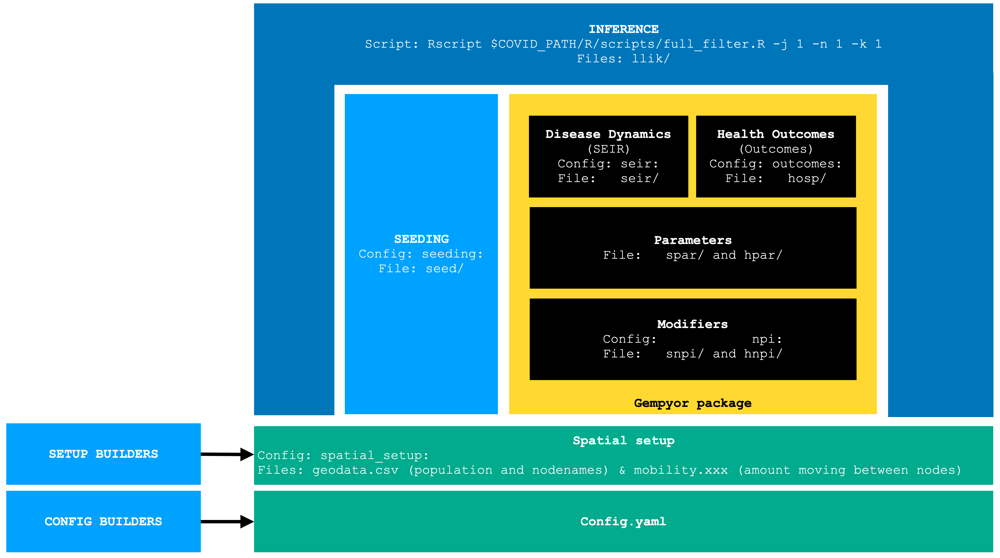

The General Epidemics Modeling Pipeline with Yterventions and Outcome Reporting, GEMPYOR is a large scale infectious disease dynamics model with configurable compartmental graph structure and interventions, to simulate metapopulation disease spread and health outcomes.

## Introduction:
It replaces the SEIR & outcomes modules -- and has many improvements. It provides a clearer interface with R. This notebook showcase some useful function of this interface and will be updated as part of the gempyor documentation. 

In this notebook, we use the term `seir` to denote everything that has to do with infectious disease dynamics (mobility, transmission, vaccination, ...) and `outcome` for everything that concerns reporting of health outcomes.



The gempyor takes as input a config, and 

- geodata.csv (required): contains the names of the spatial nodes and each node's population.
- mobility.xxx: the number of persons traveling from one node to others.
- some initial conditions (prevalence at `ti` for each compartment) or/and some seeding data (imposed transitions from one compartment to another)
- (some other files are possible such as modifiers for location-specific death rates).

## Usage

### Import
Load `reticulate`, the package to interface python and R, and choose the python environment or (or path to executable) where the gempyor package is installed. The installation section at the end of the notebook covers this stuff -- gempyor is now easy to run without docker and uses readily available python versions.  (go to the Installation section at the end), then import the package.

```{r}
library(reticulate)
library(tidyverse)
library(ggplot2)
library(tibble)
# reticulate::use_python(Sys.which('python'),require=TRUE)
reticulate::use_condaenv('covidSProd6')   
gempyor <- reticulate::import("gempyor")
```

### Building a simulator

We create an `InferenceSimulator` object by providing the path of config file.  It may take a while to run all of that. First build the object. The config used here, from the npi continuous integration tests, is derived from our recent forcast hub config: `config_FCH_R12_optSev_lowIE_blk5_Mar6.yml` on March 6, 2022.
```{r}
config_filepath = '../tests/npi/config_npi.yml'
gempyor_simulator <- gempyor$InferenceSimulator(
                          config_path=config_filepath,
                          run_id="test_run_id",
                          prefix="test_prefix/",
                          first_sim_index=1,
                          scenario="inference",   # NPIs scenario to use
                          deathrate="med",        # Outcome scenario to use
                          stoch_traj_flag=FALSE,      
                          spatial_path_prefix = '../tests/npi/' # prefix where to find the folder indicated in spatial_setup
)
```
Here we specify that the data folder specified in the config lies in the `test/npi/` folder, not in the current directory. The only mandatory arguments is the `config_path`. The default values of the other arguments are
```
  run_id="test_run_id",   # an ommited argument will be left at its default value
  prefix="test_prefix",
  first_sim_index=1,
  scenario="inference",
  deathrate="med",
  stoch_traj_flag=False,
  rng_seed=None,
  nsim=1,
  initialize=True,  
  out_run_id=None,  # if out_run_id should be different from in_run_id, put it here
  out_prefix=None,  # if out_prefix should be different from in_prefix, put it here
  spatial_path_prefix="",  # in case the data folder is on another directory
```

## Exploration methods
The `gempyor_simulator` object uncovers some methods to run simulations,and some additional functions for investigating a config or an inference run, but also for debugging purposes. The latter is described in this section.

Each function either takes:

- `()` no arguments: in which case the parameters or NPIs are drawn from the config. Each call to these functions will return a different sample from the config distributions (our prior for inference runs).
- `(load_ID=TRUE, sim_id2load=XXX)` where the parameters or NPIs will be created from (spar, snpi, hnpi) files on disc. The specific file path will be created using the COVID Scenario Pipeline file naming scheme. In this example with our prefix and run_id, it will be something like `model_output/snpi/test_prefix/000000XXX.test_run_id.snpi.parquet`
- `(bypass_DF=<some_spar_df>)` where a (spar, snpi, hnpi) dataframe is provided (R and python dataframe interface very well)
- `(bypass_FN=<some_spar_filename>)` where a custom filename can be provided, and the (spar, snpi, hnpi) will be loaded from this file name.

### Parameters
It is possible to draw the parameters of the disease dynamics. The following line draws from config (hence each call will return a different draw from the prior), but the syntax would be the same with load_ID, bypass_FN, bypass_DF, where a spar file would be loaded.
```{r}
# this variation returns a dataframe. 
params_draw_df = gempyor_simulator$get_seir_parametersDF()   # could also accept (load_ID=True, sim_id2load=XXX) or (bypass_DF=<some_spar_df>) or (bypass_FN=<some_spar_filename>)

## This return an array, which is useful together with a NPI to get the reduce parameter (cf. later in the tutorial)
params_draw_arr = gempyor_simulator$get_seir_parameters()    # could also accept (load_ID=True, sim_id2load=XXX) or (bypass_DF=<some_spar_df>) or (bypass_FN=<some_spar_filename>)

# Let's check the dataframe:
params_draw_df
```

## NPIs
NPIs, or modifiers for parameters, are objects. As with parameters, they can be built from snpi or hnpi files. Here we build them from config (hence every call will generate another draw).

```{r}
npi_seir = gempyor_simulator$get_seir_npi()                  # could also accept (load_ID=True, sim_id2load=XXX) or (bypass_DF=<some_snpi_df>) or (bypass_FN=<some_snpi_filename>)
npi_outcome = gempyor_simulator$get_outcome_npi()            # could also accept (load_ID=True, sim_id2load=XXX) or (bypass_DF=<some_hnpi_df>) or (bypass_FN=<some_hnpi_filename>)
```

Once a NPI is built, we can get the reduction for each sub-npi. This is the dataframe that gets written as hnpi or (in this example) snpi.
```{r}
npi_seir$getReductionDF()
```

We can also get the reduction in time that applies to each parameter. This is a time-series. The parameter should be lower case (This will be removed soon, TODO).
```{r, fig.show=TRUE}
reduc <- npi_seir$getReduction(param = 'r0')


reduc <- reduc %>% rownames_to_column(var = 'geoid') 
reduc <- reduc %>% 
  pivot_longer(cols=colnames(reduc %>% select(-geoid)), names_to = "date", values_to = "reduction") %>% 
  mutate(date=as.Date(date))  
# let's plot it:
reduc %>% ggplot(aes(x=date, y=reduction)) + geom_path() + facet_wrap(~ geoid)
```

Now the same for outcome. We can check which parameters gets modified by this NPI by using the `getReductionDF()` method:
```{r}
npi_outcome$getReductionDF() %>% select('parameter') %>% unique()
```

as it is only `inciditoc_all` here, we can plot it 
```{r, fig.show=TRUE}
reduc <- npi_outcome$getReduction(param = 'inciditoc_all')
# There is a bit of R to get it to something usable, it's probably a very ugly way to do this:
reduc <- reduc %>% rownames_to_column(var = 'geoid') 
reduc <- reduc %>% 
  pivot_longer(cols=colnames(reduc %>% select(-geoid)), names_to = "date", values_to = "reduction") %>%
  mutate(date=as.Date(date))

reduc %>% ggplot(aes(x=date, y=reduction)) + geom_path() + facet_wrap(~ geoid)
```


### SEIR Parameters, but reduced
We can also plot the pameters after reduction with the npi. We just have to provided the npi object. The reduction contains all parameter. Here we build it and plot R0 in time (not that the trends are inverted from the getReduction above ^)
```{r,  fig.show=TRUE}
# This will draw new parameters from config and applies the already defined NPI. If load_ID, bypass_DF or bypass_FN 
param_reduc = gempyor_simulator$get_seir_parameter_reduced(npi_seir=npi_seir) # could also accept (load_ID=True, sim_id2load=XXX) or (bypass_DF=<some_spar_df>) or (bypass_FN=<some_spar_filename>)

# We can also provide an array as returned by gempyor_simulator$get_seir_parameters() 
param_reduc_from = gempyor_simulator$get_seir_parameter_reduced(npi_seir=npi_seir, p_draw=params_draw_arr)
param_reduc <- param_reduc %>% pivot_longer(cols = param_reduc %>% select(-date, -geoid) %>% colnames(), names_to = 'parameter')

param_reduc %>% filter(parameter=='r0') %>% ggplot(aes(x=date, y=value)) + geom_line() + facet_wrap(~geoid)
```


Let's plot the vaccination rate, the same way, from the same dataframe:
```{r,  fig.show=TRUE}
param_reduc %>% filter(parameter=='nu1age18to64') %>% ggplot(aes(x=date, y=value)) + geom_path() + facet_wrap(~ geoid)
```

### Get compartment graph image
We can plot the compartment transition graph with this config. There is a possibility to apply filters in order to have a tractable graph. The graph is plotted as a separate pdf file.
```{r}
gempyor_simulator$plot_transition_graph(output_file="full_graph")
gempyor_simulator$plot_transition_graph(output_file="readable_graph", 
                                        source_filters= list(list("age0to17"), list("OMICRON", "WILD")), 
                                        destination_filters= list(list("OMICRON", "WILD")))

```
here if source_filters is [["age0to17"], ["OMICRON", "WILD"]], it means filter (keep) all transitions that have as source: age0to17 AND (OMICRON OR WILD).

{width=100% height=200}

{width=100% height=200}

## Simulate
The code in this section is very much like what is present in filter_MC.R for the inference runs: it runs the full gempyor (parameters, npi, simulation, outcomes).
These functions take as input a `seed` file with sim_id `sim_id2write`, and outputs files hpar, spar, snpi, hnpi, seir, hosp with sim_id `sim_id2write`. In case the flag load_ID is set as true, the function will also load from file the seeding, parameters and the NPIs (seed, hnpi, snpi, hpar, spar) from the simulation with sim_id `sim_id2load`. 

Here we simulate once from config, then a second time using the same values as generated by the first run:

```{r}
gempyor_simulator$one_simulation(sim_id2write=0)                                  # simulate from config
gempyor_simulator$one_simulation(sim_id2write=1, load_ID=TRUE, sim_id2load=0)     # simulate from files
```


### Little redundant example:

These two are equivalent: one uses the COVID Scenario Pipeline filename scheme, while the other provides the filename directly.
```{r,  fig.show=TRUE}
npi_outcome = gempyor_simulator$get_outcome_npi(load_ID=TRUE, sim_id2load=1)
npi_outcome = gempyor_simulator$get_outcome_npi(bypass_FN = 'model_output/hnpi/test_prefix/000000001.test_run_id.hnpi.parquet')

```


## Also...
Additional methods are provided, one of which updates the prefix, which is done by e.g filter_mc_MC.R to indicate the slot
```{r}
gempyor_simulator$update_prefix(new_prefix="my new prefix")
```

## Installation
You'll need a working python3.7 installation. The gempyor package dependencies are:
```
 numba >=0.53.1
 pandas
 numpy
 seaborn
 tqdm
 matplotlib
 seaborn
 click
 confuse
 pyarrow
 sympy
 dask
 pytest ## only to run test
 scipy
 graphviz
```

### Normal python
This command will install the package and all its dependencies (the `-e` makes so that when you pull the pipeline repository again, there is no need for re-installing).
```
pip install -e gempyor_pkg/
```
If the dependencies are already there and you don't want to risk updating them because of your other python projects, do
```
pip install --no-deps -e gempyor_pkg/
```

### python in the docker
In the docker we have to update pip before:
```
/home/app/python_venv/bin/python3.7 -m pip install --upgrade pip # needs new pip for toml file
pip install -e gempyor_pkg/
```

### Conda (simple)
If you use conda, let's create a conda environment with everything needed:s
```
conda create -n covidSProd6 python=3.7
conda activate covidSProd6
conda install -c conda-forge jupyterlab ipykernel  dask click confuse matplotlib numba">=0.53" numpy pandas pyarrow pytest scipy seaborn sympy tqdm python-graphviz
pip install --no-deps -e gempyor_pkg/
```

### Conda (complicated)
This conda environment allows you to run both the R and the python code. It is not recommended except to run on HPCs. Here the full pipeline R and python code will work on pinned version.
```
conda create -n covidSProd6 -c conda-forge python jupyterlab ipykernel dask graphviz fastparquet click confuse matplotlib networkx numba">=0.53" numpy pandas pyarrow pytest scipy seaborn sympy  tqdm r-essentials python-graphviz
conda activate covidSProd6
python -m ipykernel install --user --name covidSProd6 --display-name "Python (covidSProd6)"
export R_PROFILE=$COVID_PATH/slurm_batch/Rprofile
conda install r-devtools  r-gridExtra r-ggfortify r-flextable r-doparallel r-reticulate r-truncnorm r-arrow
conda install r-tigris
conda install r-tidycensus r-optparse
conda env export --from-history > environment_cross.yml
conda env export > environment.yml
```


